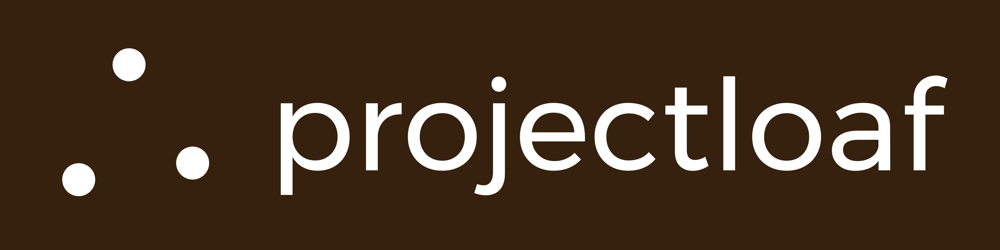

[](http://www.projectloaf.net)

# Loaf Triangulation

## Table of Contents

* [Abstract](#abstract)
* [Dependencies](#dependencies)
* [Setup](#setup)
* [Math](#math)
* [Results](#results)
* [Usage](#usage)
* [Contributing](#Contributing)
* [License](#license)

## Abstract

In almost every household in the United States, WiFi signals are present. In this experiment/project, we will develop software to sniff for active probes emitted by connection attempts from WiFi-enabled devices such as smartphones. In every WiFi request, there is a present Received Signal Strength Indicator (RSSI) which shows a -dBm value. As the RSSI value is the strength of the WiFi signal between the wireless access point (WiFi AP), we can correlate this value with distance as well as obstructions. However, WiFi signals fluctuate because of WiFi signal reflections. In this experiment, we will attempt to trilaterate the internal position of a WiFi-enabled device.

### Dependencies

* Python 3
* Node.js
* 3 Raspberry Pis
* A compatible WiFi adapter that supports terminal mode

### Setup

Clone this repository on your host machine (e.g. the computer you're on right now)

```bash
$ git clone https://github.com/DevinMui/LoafTriangle
```

Turn on the Pis and run cluster.py with the initialize option and input the configuration on your local machine

```bash
$ python3 cluster.py initialize
```

Visit `http://localhost:3000/track` to look at the JSON response (distance is returned in meters)

#### Example response

```json
{
    "android": {
        "x": 2.150814795347777,
        "y": 1.1330543893206393
    },
    "node0": {
        "distance": 0.5011872336272722,
        "mac": "b8:27:eb:ec:77:38"
    },
    "node1": {
        "distance": 0.6309573444801932,
        "mac": "b8:27:eb:c5:51:a0"
    },
    "node2": {
        "distance": 0.31622776601683794,
        "mac": "b8:27:eb:6f:af:5f"
    }
}
```

To stop the Raspberry Pi servers

```bash
$ python 3 cluster.py stop
```

### Math

Calculating position:

[](lawofCosines.gif)

Converting RSSI to meters:

[](logDistancePathlossModel.gif)

### Results

#### Calculating position (7/31/2017)

Unfortunately, the RSSI values were all over the place when calculating the position of the RPis. This could have been the result of WiFi signals being reflected or other signal noises causing a change in the RSSI value. The values resulted in a drastic accuracy drop for trilaterating device positions as the RPi positions were incredibly inaccurate. This was fixed in the device position test by manually recording distances between the devices and using basic trigonometry (law of cosines) to find the positions of the RPis. Before the fix, we had an accuracy of roughly +/-8m and where each RPi's position had an accuracy of +/-3m. After the fix, we had an accuracy of +/-3m. In the future, we plan to utilize filters to smoothen the RSSI data to increase the device position accuracy.

#### Calculating device position (7/31/2017)

Calculating the device's position involved trilateration to find the device's position. In a few tests, we determined the accuracy of this system to be +/-3m with no obstructions. With obstructions, the perceived position fluctuated with the best accuracy being +/-2m and the worst result being +/-6m. In the tests, the device was positioned on top of a table with a position of about (2m, 4m). In a few tests, the device was partially obstructed by chairs. In other tests, the device was not obstructed at all. 

##### Error Analysis

We did not have a tape measure with meters so we had to estimate the conversion of meters to feet. We used the formula:

`meters = feet * 3`

to estimate meters. A more accurate measurement would have been:

`meters = feet * 3.28084`

Using this formula in our video would have most likely increased our accuracy by half a meter or more. Further improvements would be to implement Kalman filtering to remove noise from RSSI signals and provide a better a0 for RSSI to meter conversion algorithm with the Log-Distance Pathloss model. Other improvements we would need is to implement a way to remove noise from obstructions.

### Usages

* Store heatmaps
* Store user data/preferences
* Smart home
* Robotics
* Security
* Room classifiers
* Length of line
* more...

### Contributors

* Devin Mui
* Jesse Liang

### License

```
The MIT License

Copyright (c) 2017 Projectloaf http://projectloaf.net

Permission is hereby granted, free of charge, to any person obtaining a copy
of this software and associated documentation files (the "Software"), to deal
in the Software without restriction, including without limitation the rights
to use, copy, modify, merge, publish, distribute, sublicense, and/or sell
copies of the Software, and to permit persons to whom the Software is
furnished to do so, subject to the following conditions:

The above copyright notice and this permission notice shall be included in
all copies or substantial portions of the Software.

THE SOFTWARE IS PROVIDED "AS IS", WITHOUT WARRANTY OF ANY KIND, EXPRESS OR
IMPLIED, INCLUDING BUT NOT LIMITED TO THE WARRANTIES OF MERCHANTABILITY,
FITNESS FOR A PARTICULAR PURPOSE AND NONINFRINGEMENT. IN NO EVENT SHALL THE
AUTHORS OR COPYRIGHT HOLDERS BE LIABLE FOR ANY CLAIM, DAMAGES OR OTHER
LIABILITY, WHETHER IN AN ACTION OF CONTRACT, TORT OR OTHERWISE, ARISING FROM,
OUT OF OR IN CONNECTION WITH THE SOFTWARE OR THE USE OR OTHER DEALINGS IN
THE SOFTWARE.
```

### Contributing

[Contribution guidelines for this project](CONTRIBUTING.md)
